Data analysis sample
================
Celina Geiss
2022-02-04

-   [Setup](#setup)
    -   [Libraries](#libraries)
    -   [Data](#data)
-   [Linear model](#linear-model)
    -   [Design](#design)
    -   [Fit](#fit)
    -   [Model results](#model-results)
        -   [Coefficients](#coefficients)
-   [Functional analyses](#functional-analyses)
    -   [Gene set enrichment analysis](#gene-set-enrichment-analysis)
    -   [Pathway activity (PROGENy)](#pathway-activity-progeny)
    -   [TF activity (DoRothEA)](#tf-activity-dorothea)
-   [Export results](#export-results)
-   [Session info](#session-info)

Here, we will investigate the effect of the organellar Ca2+ regulator
protein (OCaR2) on *β*-adrenergic induced cardiac stress. The data
comprises bulk RNA-seq counts of WT and KO mice treated either with
isoproterenol, a *β*-adrenoreceptor agonist, and saline as control
conditions. KO-iso mice display fatal ventricular arrhythmia a couple of
days after stimulation. We therefore want to elucidate which
compensating processes are deranged by the abscence of OCaR2.

In this script we will apply a linear model to dissect the effects of
genotype, treatment and the interaction of both (KO-iso) and enrich the
associated genes in regard to pathways and transcription factor
activity.

# Setup

## Libraries

``` r
# Standard libraries
library(here)
source(here("R", "standard_libs.R"))

# Main libraries
library(cowplot)
library(limma)
library(fgsea)
library(progeny)
library(dorothea)
library(pheatmap)
library(ggrepel)

source(here("R", "support_functions_OCaR2.R"))
source(here("R", "support_functions_transcriptutorial.R"))
source(here("R", "colour_scheme.R"))
```

## Data

``` r
# Filtered & VSN normalised counts
counts_vsn <- read_rds(here("Data", "data_processed", "counts.OCaR-IsoT_filtered_&_normalised.rds"))
counts_vsn
```

    ## # A tibble: 13,210 × 18
    ##    ensembl   gene  WT_saline_R1 WT_saline_R2 WT_saline_R3 WT_saline_R4 WT_iso_R1
    ##    <chr>     <chr>        <dbl>        <dbl>        <dbl>        <dbl>     <dbl>
    ##  1 ENSMUSG0… Gnai3         9.30         9.30         9.40         9.34      9.63
    ##  2 ENSMUSG0… Cdc45         7.45         7.17         7.22         7.29      7.51
    ##  3 ENSMUSG0… H19          10.2          9.72         9.85         9.84     10.2 
    ##  4 ENSMUSG0… Narf         11.6         11.7         11.7         11.6      11.7 
    ##  5 ENSMUSG0… Cav2          9.64         9.74         9.68         9.59      9.95
    ##  6 ENSMUSG0… Klf6         11.1         11.2         11.2         11.4      11.8 
    ##  7 ENSMUSG0… Scmh1        10.1         10.0          9.89         9.97      9.90
    ##  8 ENSMUSG0… Cox5a        12.9         13.1         13.1         13.2      12.6 
    ##  9 ENSMUSG0… Tbx2          8.59         8.68         8.72         8.95      8.97
    ## 10 ENSMUSG0… Wnt9a         7.61         7.82         7.79         7.72      7.53
    ## # … with 13,200 more rows, and 11 more variables: WT_iso_R2 <dbl>,
    ## #   WT_iso_R3 <dbl>, WT_iso_R4 <dbl>, KO_saline_R1 <dbl>, KO_saline_R2 <dbl>,
    ## #   KO_saline_R3 <dbl>, KO_saline_R4 <dbl>, KO_iso_R1 <dbl>, KO_iso_R2 <dbl>,
    ## #   KO_iso_R3 <dbl>, KO_iso_R4 <dbl>

``` r
# Targets table
targets <- read_rds(here("Data", "data_processed", "targets.OCaR-IsoT.rds"))
targets
```

    ## # A tibble: 16 × 6
    ##    sample       condition genotype treatment rep   sample_name   
    ##    <fct>        <fct>     <fct>    <fct>     <chr> <fct>         
    ##  1 WT_saline_R1 WT-saline WT       saline    R1    WT-saline (R1)
    ##  2 WT_saline_R2 WT-saline WT       saline    R2    WT-saline (R2)
    ##  3 WT_saline_R3 WT-saline WT       saline    R3    WT-saline (R3)
    ##  4 WT_saline_R4 WT-saline WT       saline    R4    WT-saline (R4)
    ##  5 WT_iso_R1    WT-iso    WT       iso       R1    WT-iso (R1)   
    ##  6 WT_iso_R2    WT-iso    WT       iso       R2    WT-iso (R2)   
    ##  7 WT_iso_R3    WT-iso    WT       iso       R3    WT-iso (R3)   
    ##  8 WT_iso_R4    WT-iso    WT       iso       R4    WT-iso (R4)   
    ##  9 KO_saline_R1 KO-saline KO       saline    R1    KO-saline (R1)
    ## 10 KO_saline_R2 KO-saline KO       saline    R2    KO-saline (R2)
    ## 11 KO_saline_R3 KO-saline KO       saline    R3    KO-saline (R3)
    ## 12 KO_saline_R4 KO-saline KO       saline    R4    KO-saline (R4)
    ## 13 KO_iso_R1    KO-iso    KO       iso       R1    KO-iso (R1)   
    ## 14 KO_iso_R2    KO-iso    KO       iso       R2    KO-iso (R2)   
    ## 15 KO_iso_R3    KO-iso    KO       iso       R3    KO-iso (R3)   
    ## 16 KO_iso_R4    KO-iso    KO       iso       R4    KO-iso (R4)

``` r
# Load gene sets for GSEA
source(here("R", "import_gene_sets.R"))
```

Let’s first take a look at the distribution of the filtered and
normalised counts:

``` r
dlookr::diagnose_numeric(counts_vsn)
```

    ## # A tibble: 16 × 10
    ##    variables      min    Q1  mean median    Q3   max  zero minus outlier
    ##    <chr>        <dbl> <dbl> <dbl>  <dbl> <dbl> <dbl> <int> <int>   <int>
    ##  1 WT_saline_R1  6.91  8.02  9.30   9.11  10.3  21.8     0     0     190
    ##  2 WT_saline_R2  6.93  8.03  9.29   9.11  10.3  21.7     0     0     203
    ##  3 WT_saline_R3  6.92  8.02  9.30   9.12  10.3  21.7     0     0     189
    ##  4 WT_saline_R4  6.85  8.02  9.29   9.12  10.3  21.7     0     0     191
    ##  5 WT_iso_R1     6.67  8.05  9.31   9.15  10.3  21.5     0     0     182
    ##  6 WT_iso_R2     6.75  8.04  9.31   9.15  10.3  21.5     0     0     179
    ##  7 WT_iso_R3     6.76  8.04  9.31   9.14  10.3  21.6     0     0     175
    ##  8 WT_iso_R4     6.84  8.03  9.31   9.15  10.3  21.5     0     0     172
    ##  9 KO_saline_R1  6.81  8.01  9.29   9.13  10.3  21.7     0     0     178
    ## 10 KO_saline_R2  6.92  8.01  9.30   9.11  10.3  21.7     0     0     185
    ## 11 KO_saline_R3  6.88  8.01  9.29   9.11  10.3  21.7     0     0     180
    ## 12 KO_saline_R4  6.84  8.01  9.30   9.13  10.3  21.6     0     0     179
    ## 13 KO_iso_R1     6.69  8.11  9.34   9.21  10.3  20.9     0     0     165
    ## 14 KO_iso_R2     6.71  8.16  9.36   9.24  10.3  20.6     0     0     152
    ## 15 KO_iso_R3     6.69  8.10  9.33   9.19  10.3  21.1     0     0     162
    ## 16 KO_iso_R4     6.58  8.13  9.34   9.21  10.3  20.7     0     0     172

``` r
plot_violins(counts_vsn, targets, "Filtered & normalised log2(counts)")
```

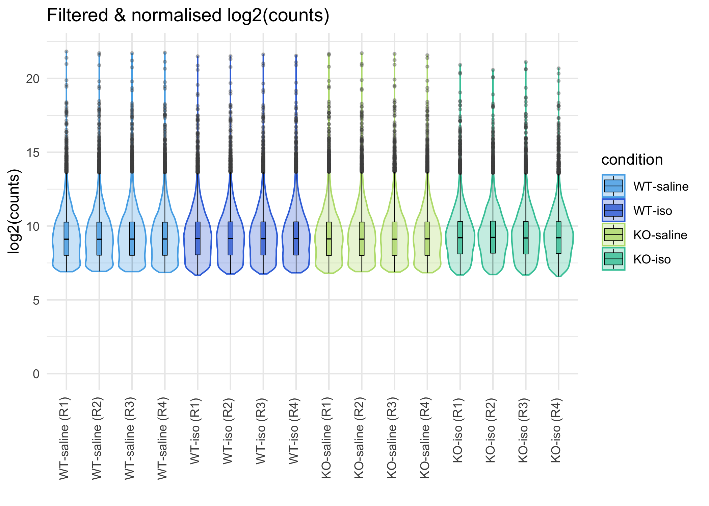

# Linear model

We want to build a linear regression model to dissect the contribution
of each condition to each gene.

GEX = *β*<sub>1</sub> + *β*<sub>2</sub> ⋅ KO + *β*<sub>3</sub> ⋅ Iso + *β*<sub>4</sub> ⋅ KO-Iso

The *β* values are the coefficients for each condition, representing the
weight or extent by which a gene changes. *β*<sub>0</sub> is the
intercept, meaning the base condition (WT-saline).

Since we have genotype and treatment observations, this corresponds a
2x2 factorial design interaction model (see chapter 9.5 in [limma user
guide](https://www.bioconductor.org/packages/release/bioc/vignettes/limma/inst/doc/usersguide.pdf)).

## Design

``` r
Genotype_ <- factor(targets$genotype, levels = c("WT", "KO"))
Treatment_ <- factor(targets$treatment, levels = c("saline", "iso"))

design_matrix <- model.matrix(~ Genotype_*Treatment_)
design_matrix
```

    ##    (Intercept) Genotype_KO Treatment_iso Genotype_KO:Treatment_iso
    ## 1            1           0             0                         0
    ## 2            1           0             0                         0
    ## 3            1           0             0                         0
    ## 4            1           0             0                         0
    ## 5            1           0             1                         0
    ## 6            1           0             1                         0
    ## 7            1           0             1                         0
    ## 8            1           0             1                         0
    ## 9            1           1             0                         0
    ## 10           1           1             0                         0
    ## 11           1           1             0                         0
    ## 12           1           1             0                         0
    ## 13           1           1             1                         1
    ## 14           1           1             1                         1
    ## 15           1           1             1                         1
    ## 16           1           1             1                         1
    ## attr(,"assign")
    ## [1] 0 1 2 3
    ## attr(,"contrasts")
    ## attr(,"contrasts")$Genotype_
    ## [1] "contr.treatment"
    ## 
    ## attr(,"contrasts")$Treatment_
    ## [1] "contr.treatment"

We can interpret the `design_matrix` as follows:

| *β* | Coefficient                 | Comparison                                  | Interpretation               |
|-----|-----------------------------|---------------------------------------------|------------------------------|
| 1   | `(Intercept)`               | WT-saline                                   | null/control condition       |
| 2   | `Genotype_KO`               | KO-saline - WT-saline                       | basic effect of KO on saline |
| 3   | `Treatment_iso`             | WT-iso - WT-saline                          | basic effect of iso on WT    |
| 4   | `Genotype_KO:Treatment_iso` | (KO-iso - KO-saline) - (WT-iso - WT-saline) | combined effect of KO & iso  |

The KO-iso effect is not directly represented, but we can extract it as
the sum of coefficients 3 + 4.

With the coefficients we get the following combinations, each
representing the mean of one condition:

-   (1 1 1 1): WT-saline
-   (1 1 0 0): WT-iso
-   (1 0 1 0): KO-saline
-   (1 0 0 0): KO-iso

## Fit

Now we fit the model to our gene expression data. The function
`eBayes()` calculates the empirical Bayes statistics of differentially
expressed genes:

-   `logFC`: log2-fold change
-   `AveExpr`: average log2 expression level across all experiments
-   `t`: moderated t-statistic (like ordinary t-statistic, but standard
    errors across genes)
-   `P.Value` and `adj.P.Value`: associated p-value and adjustment for
    multiple testing (default: BH/FDR)
-   `lods` or `B`: B-statistic, log-odds that gene is differentially
    expressed
-   `F`: moderated F-statistics (tests, if a gene is differentially
    expressed in any contrast)

``` r
counts_df <- counts_vsn %>% select(-gene) %>% column_to_rownames(var ="ensembl")
lm_fit <- lmFit(counts_df, design_matrix) %>% eBayes()
```

## Model results

When we want to summarise the results of the model we can use some
limma-provided functions:

-   `decideTests()`: identify significantly DEGs
-   `topTable()`: shows the n top genes of a selected contrast

``` r
lm_results <- decideTests(lm_fit, adjust.method = "BH") 
summary(lm_results)
```

    ##        (Intercept) Genotype_KO Treatment_iso Genotype_KO:Treatment_iso
    ## Down             0          52          1548                      2097
    ## NotSig           0       13073          9744                      8804
    ## Up           13210          85          1918                      2309

``` r
vennDiagram(lm_results, cex = 1, include = c("up", "down"))
```


### Coefficients

``` r
# Genotype-associated genes
top_genotype <- topTable(lm_fit, coef = "Genotype_KO", number = Inf, adjust.method = "BH") %>%
  rownames_to_column("ensembl") %>% 
  as_tibble() %>% 
  annotate_GO_description()
  
top_genotype_filtered <- top_genotype %>% filter(adj.P.Val < 0.15)

# Treatment-associated genes
top_treatment <- topTable(lm_fit, coef = "Treatment_iso", number = Inf, adjust.method = "BH") %>%
  rownames_to_column("ensembl") %>% 
  as_tibble() %>% 
  annotate_GO_description()

top_treatment_filtered <- top_treatment %>% filter(adj.P.Val < 0.15)

# Interaction-associated genes
top_interaction <- topTable(lm_fit, coef = "Genotype_KO:Treatment_iso", number = Inf, adjust.method = "BH") %>%
  rownames_to_column("ensembl") %>% 
  as_tibble() %>% 
  annotate_GO_description() 

top_interaction_filtered <- top_interaction %>% filter(adj.P.Val < 0.15)
```

#### Unique genes

We can see that several genes appear in the top list of several
conditions. We now want to find out which genes are unique to the
genotype and treatment and do not occur in the interaction.

``` r
top_genotype_unique <- top_genotype %>% 
  filter(ensembl %in% setdiff(top_genotype_filtered$ensembl,
                              top_interaction_filtered$ensembl))

top_treatment_unique <- top_treatment %>% 
  filter(ensembl %in% setdiff(top_treatment_filtered$ensembl,
                              top_interaction_filtered$ensembl))
```

#### Boxplot of top genes

``` r
make_boxplots_top_genes(slice(top_genotype_unique, 1:25), "genotype", "Genotype effect", colours_iso)
```

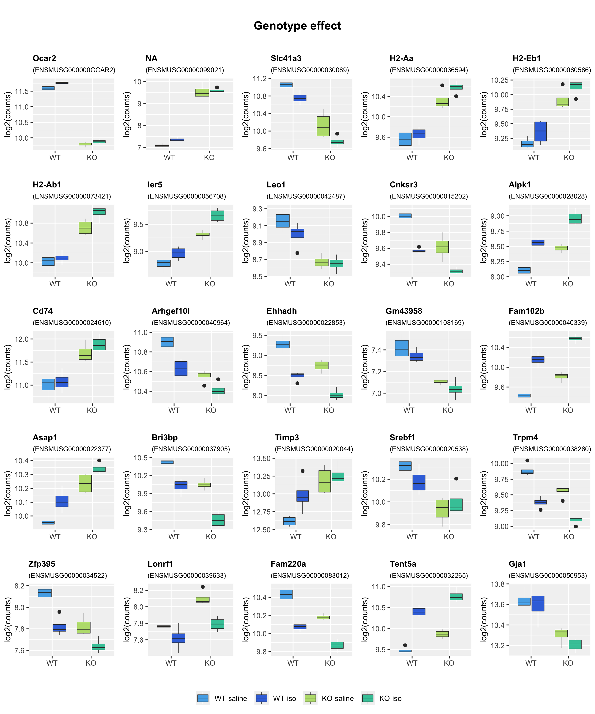

``` r
make_boxplots_top_genes(slice(top_treatment_unique, 1:25), "treatment", "Treatment effect", colours_iso)
```

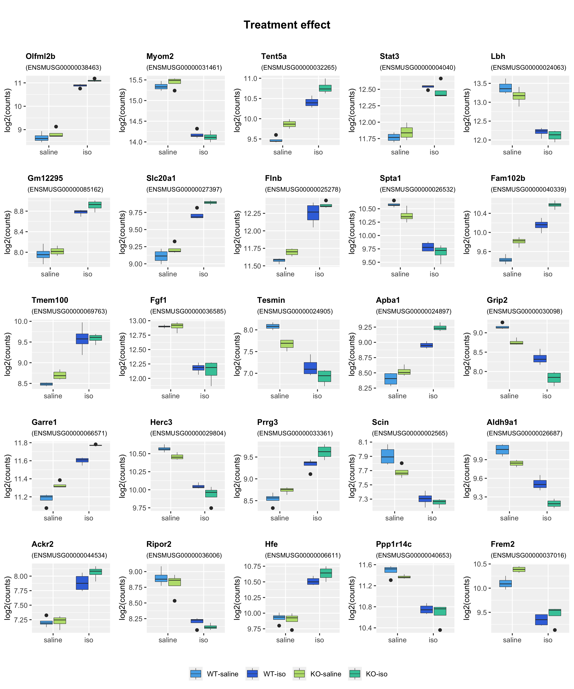

``` r
make_boxplots_top_genes(slice(top_interaction, 1:25), "treatment", "Interaction effect", colours_iso)
```

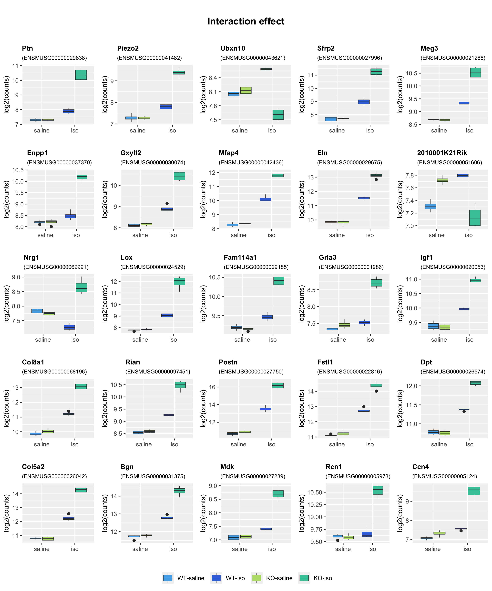

# Functional analyses

## Gene set enrichment analysis

The statistical enrichment of the expression data will give us a hint on
the genotype- and tratment-affected pathways. As prior knowledge we use
the hallmark pathway sets of the database
[MSigDB](https://www.gsea-msigdb.org/gsea/msigdb/).

``` r
# Run function fsgea
run_fsgea <- function(genesets, rank_table) {
  gsea_genotype <- fgseaSimple(pathways = genesets,
                               stats = rank_table,
                               minSize = 15, 
                               maxSize = 300,
                               nperm = 1000) %>% 
  as_tibble() %>% 
  arrange(desc(abs(NES)))
}

ready4gsea <- function(rank_table) {
  rank_table %>% 
    select(gene, t) %>% 
    distinct(gene, .keep_all = T) %>% 
    deframe()
}
```

``` r
# Coefficients
gsea_hallmark_genotype <- run_fsgea(gs_hallmark, ready4gsea(top_genotype))
gsea_hallmark_treatment <- run_fsgea(gs_hallmark, ready4gsea(top_treatment))
gsea_hallmark_interaction <- run_fsgea(gs_hallmark, ready4gsea(top_interaction))
```

``` r
make_GSEA_plot(gsea_hallmark_genotype, 
               "MSigDB hallmark gene sets", "Genotype effect")
```

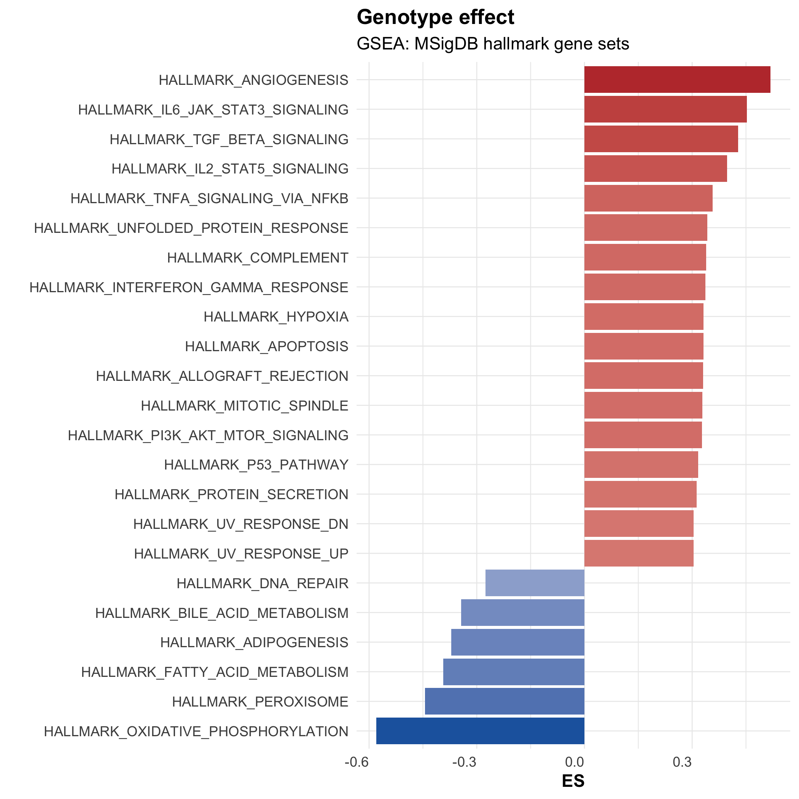

``` r
make_GSEA_plot(gsea_hallmark_treatment, 
               "MSigDB hallmark gene sets", "Treatment effect")
```

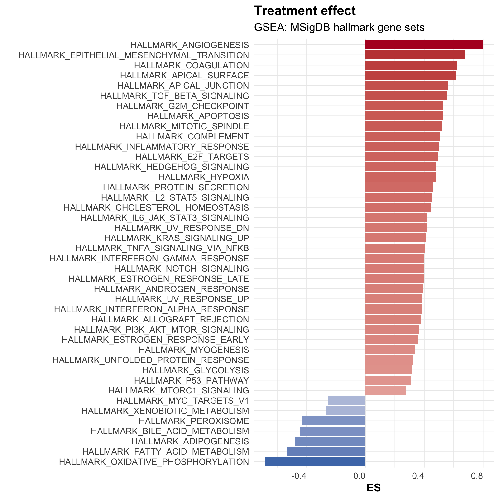

``` r
make_GSEA_plot(gsea_hallmark_interaction, 
               "MSigDB hallmark gene sets", "Interaction effect")
```

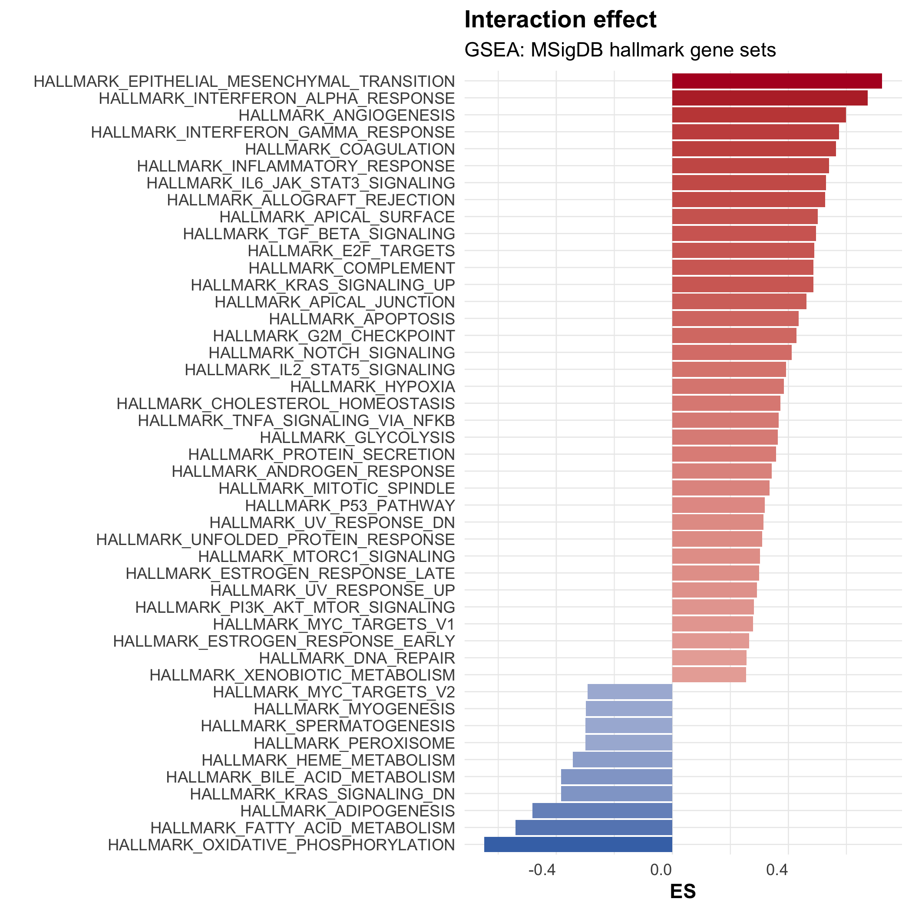

## Pathway activity (PROGENy)

[PROGENy](https://saezlab.github.io/progeny/) is a tool developed by the
lab of Julio Saez-Rodriguez that infers the activities of 14
well-established pathways from the footprints gene expression.

``` r
run_progeny <- function(gene_matrix) {
  progeny(gene_matrix, 
          scale = F, organism = "Mouse", top = 100, perm = 10000, 
          z_scores = TRUE) %>%
    t() %>% 
    as_tibble(rownames = "pathway")
}
```

``` r
t_val_coef <- full_join(top_genotype %>% select(gene, genotype = t),
                        top_treatment %>% select(gene, treatment = t), by = "gene") %>% 
  full_join(top_interaction %>% select(gene, interaction = t), by = "gene") %>% 
  drop_na()

t_val_coef_matrix <- t_val_coef %>% 
  distinct(gene, .keep_all = TRUE) %>% 
  column_to_rownames(var = "gene") %>% 
  as.matrix()

progeny_activity_coef <- run_progeny(t_val_coef_matrix)
```

``` r
progeny_plots_coef <- map(names(progeny_activity_coef)[2:4], function(coef) {
  plot_pathway_activity(progeny_activity_coef %>% select(pathway, coef),
                        coef,
                        paste0(str_to_sentence(coef), " effect"))
})

progeny_plots_coef
```

    ## [[1]]

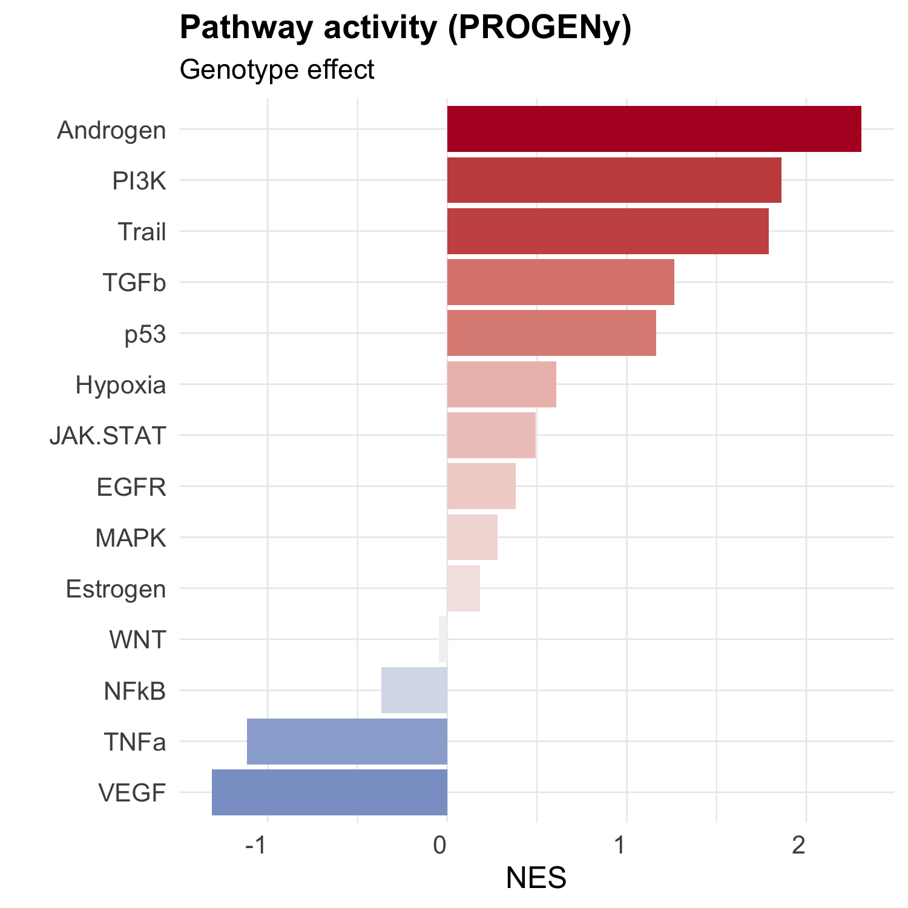

    ## 
    ## [[2]]

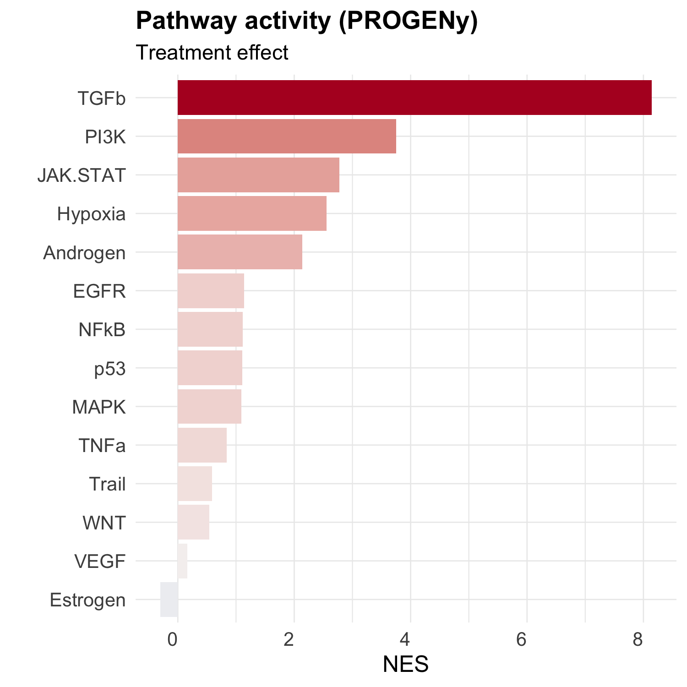

    ## 
    ## [[3]]

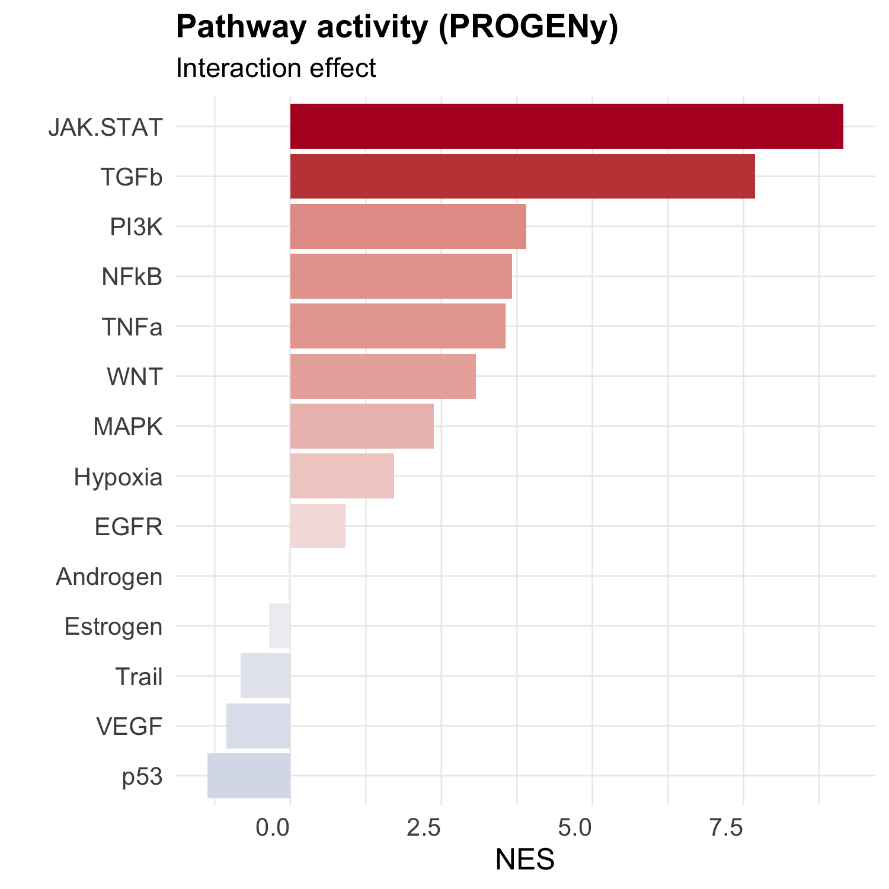

## TF activity (DoRothEA)

Similar to PROGENy, [DoRothEA](https://saezlab.github.io/dorothea/)
infers transcription factor activities from the footprints of gene
expression.

``` r
# Load Dorothea Regulons
data("dorothea_mm", package = "dorothea")
regulons <- dorothea_mm %>%
  dplyr::filter(confidence %in% c("A", "B","C"))
```

``` r
tf_activities_stat_coef <- dorothea::run_viper(t_val_coef_matrix, regulons,
                                               options = list(minsize = 5, eset.filter = FALSE, 
                                                           cores = 1, verbose = FALSE, nes = TRUE)) %>% 
    as_tibble(rownames = "gene")
```

``` r
TF_activity_plots_coef <- map(names(tf_activities_stat_coef)[2:4], function(coef) {
  plot_TF_activity(tf_activities_stat_coef %>% select(gene, coef),
                   coef,
                   paste0(str_to_sentence(coef), " effect"))
})

TF_activity_plots_coef
```

    ## [[1]]

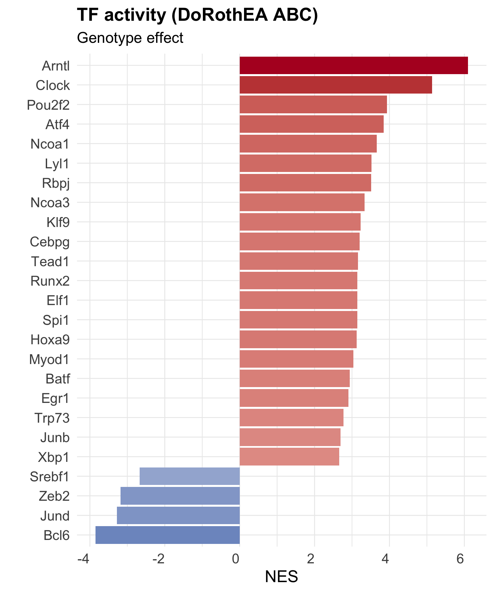

    ## 
    ## [[2]]

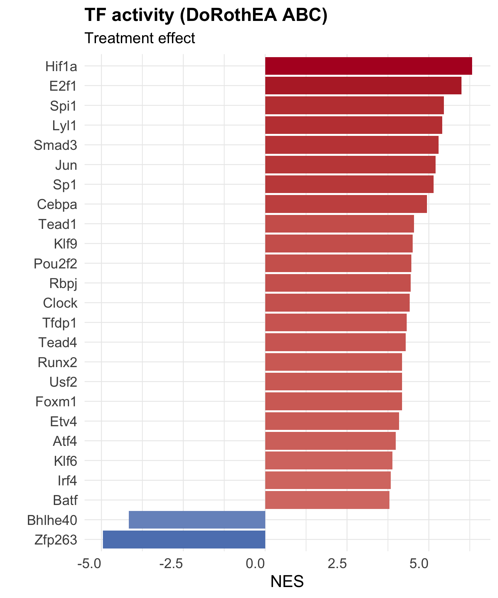

    ## 
    ## [[3]]

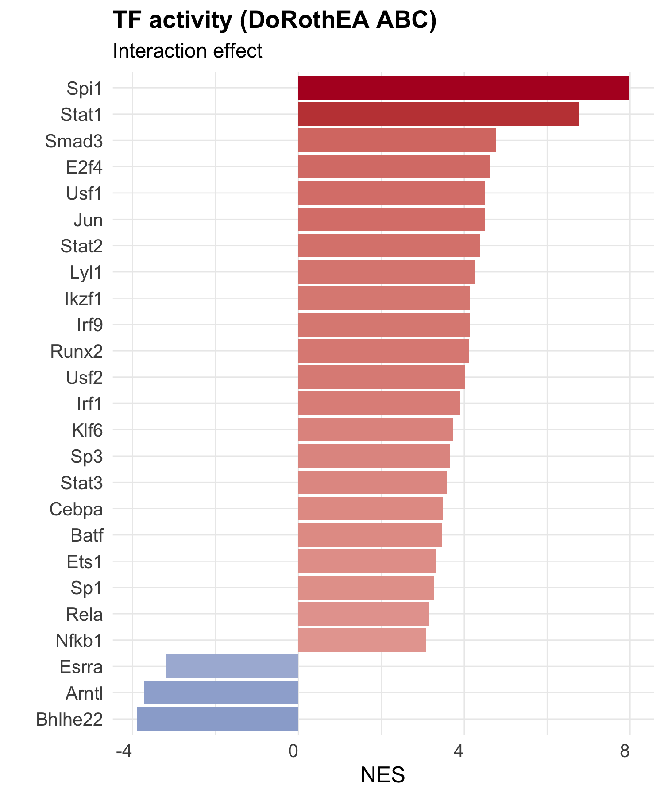

# Export results

``` r
# Coefficient genes
write_rds(top_genotype, here("Data", "data_processed", "IsoT_stats_genotype_effect.rds"))
write_rds(top_treatment, here("Data", "data_processed", "IsoT_stats_treatment_effect.rds"))
write_rds(top_interaction, here("Data", "data_processed", "IsoT_stats_interaction_effect.rds"))
```

------------------------------------------------------------------------

# Session info

``` r
devtools::session_info()
```

    ## ─ Session info ───────────────────────────────────────────────────────────────
    ##  setting  value
    ##  version  R version 4.1.2 (2021-11-01)
    ##  os       macOS Monterey 12.1
    ##  system   aarch64, darwin20
    ##  ui       X11
    ##  language (EN)
    ##  collate  en_US.UTF-8
    ##  ctype    en_US.UTF-8
    ##  tz       Europe/Berlin
    ##  date     2022-02-04
    ##  pandoc   2.14.0.3 @ /Applications/RStudio.app/Contents/MacOS/pandoc/ (via rmarkdown)
    ## 
    ## ─ Packages ───────────────────────────────────────────────────────────────────
    ##  ! package      * version date (UTC) lib source
    ##    assertthat     0.2.1   2019-03-21 [1] CRAN (R 4.1.0)
    ##    bcellViper     1.30.0  2021-10-30 [1] Bioconductor
    ##    Biobase        2.54.0  2021-10-26 [1] Bioconductor
    ##    BiocGenerics   0.40.0  2021-10-26 [1] Bioconductor
    ##  P BiocParallel   1.28.0  2021-10-26 [?] Bioconductor
    ##    bit            4.0.4   2020-08-04 [1] CRAN (R 4.1.1)
    ##    bit64          4.0.5   2020-08-30 [1] CRAN (R 4.1.0)
    ##  P cachem         1.0.6   2021-08-19 [?] CRAN (R 4.1.1)
    ##    callr          3.7.0   2021-04-20 [1] CRAN (R 4.1.0)
    ##  P class          7.3-19  2021-05-03 [3] CRAN (R 4.1.2)
    ##    cli            3.1.0   2021-10-27 [1] CRAN (R 4.1.1)
    ##  P codetools      0.2-18  2020-11-04 [3] CRAN (R 4.1.2)
    ##    colorspace     2.0-2   2021-06-24 [1] CRAN (R 4.1.1)
    ##  P cowplot      * 1.1.1   2020-12-30 [?] CRAN (R 4.1.1)
    ##    crayon         1.4.2   2021-10-29 [1] CRAN (R 4.1.1)
    ##    data.table     1.14.2  2021-09-27 [1] CRAN (R 4.1.1)
    ##    DBI            1.1.1   2021-01-15 [1] CRAN (R 4.1.0)
    ##  P desc           1.4.0   2021-09-28 [?] CRAN (R 4.1.1)
    ##    devtools       2.4.3   2021-11-30 [1] CRAN (R 4.1.1)
    ##    digest         0.6.29  2021-12-01 [1] CRAN (R 4.1.1)
    ##  P dlookr         0.5.4   2021-12-06 [?] CRAN (R 4.1.1)
    ##    dorothea     * 1.6.0   2021-10-30 [1] Bioconductor
    ##  P dplyr        * 1.0.7   2021-06-18 [?] CRAN (R 4.1.0)
    ##    e1071          1.7-9   2021-09-16 [1] CRAN (R 4.1.1)
    ##    ellipsis       0.3.2   2021-04-29 [1] CRAN (R 4.1.0)
    ##  P evaluate       0.14    2019-05-28 [?] CRAN (R 4.1.0)
    ##  P extrafont      0.17    2014-12-08 [?] CRAN (R 4.1.0)
    ##  P extrafontdb    1.0     2012-06-11 [?] CRAN (R 4.1.0)
    ##    fansi          0.5.0   2021-05-25 [1] CRAN (R 4.1.0)
    ##    farver         2.1.0   2021-02-28 [1] CRAN (R 4.1.0)
    ##    fastmap        1.1.0   2021-01-25 [1] CRAN (R 4.1.0)
    ##    fastmatch      1.1-3   2021-07-23 [1] CRAN (R 4.1.0)
    ##    fgsea        * 1.20.0  2021-10-26 [1] Bioconductor
    ##    forcats        0.5.1   2021-01-27 [1] CRAN (R 4.1.1)
    ##  P Formula        1.2-4   2020-10-16 [?] CRAN (R 4.1.0)
    ##    fs             1.5.2   2021-12-08 [1] CRAN (R 4.1.1)
    ##  P gdtools        0.2.3   2021-01-06 [?] CRAN (R 4.1.0)
    ##    generics       0.1.1   2021-10-25 [1] CRAN (R 4.1.1)
    ##  P ggplot2      * 3.3.5   2021-06-25 [?] CRAN (R 4.1.1)
    ##  P ggrepel      * 0.9.1   2021-01-15 [?] CRAN (R 4.1.1)
    ##  P glue           1.5.1   2021-11-30 [?] CRAN (R 4.1.1)
    ##  P gridExtra      2.3     2017-09-09 [?] CRAN (R 4.1.1)
    ##    gtable         0.3.0   2019-03-25 [1] CRAN (R 4.1.1)
    ##  P here         * 1.0.1   2020-12-13 [?] CRAN (R 4.1.0)
    ##  P highr          0.9     2021-04-16 [?] CRAN (R 4.1.0)
    ##    hms            1.1.1   2021-09-26 [1] CRAN (R 4.1.1)
    ##  P hrbrthemes     0.8.0   2020-03-06 [?] CRAN (R 4.1.1)
    ##    htmltools      0.5.2   2021-08-25 [1] CRAN (R 4.1.1)
    ##    htmlwidgets    1.5.4   2021-09-08 [1] CRAN (R 4.1.1)
    ##    httpuv         1.6.4   2021-12-14 [1] CRAN (R 4.1.1)
    ##    httr           1.4.2   2020-07-20 [1] CRAN (R 4.1.0)
    ##  P inum           1.0-4   2021-04-12 [?] CRAN (R 4.1.0)
    ##  P kableExtra     1.3.4   2021-02-20 [?] CRAN (R 4.1.1)
    ##    kernlab        0.9-29  2019-11-12 [1] CRAN (R 4.1.0)
    ##  P KernSmooth     2.23-20 2021-05-03 [3] CRAN (R 4.1.2)
    ##  P knitr          1.36    2021-09-29 [?] CRAN (R 4.1.1)
    ##    labeling       0.4.2   2020-10-20 [1] CRAN (R 4.1.0)
    ##    later          1.3.0   2021-08-18 [1] CRAN (R 4.1.1)
    ##  P lattice        0.20-45 2021-09-22 [3] CRAN (R 4.1.2)
    ##  P libcoin        1.0-9   2021-09-27 [?] CRAN (R 4.1.1)
    ##    lifecycle      1.0.1   2021-09-24 [1] CRAN (R 4.1.1)
    ##    limma        * 3.50.0  2021-10-26 [1] Bioconductor
    ##  P magrittr       2.0.1   2020-11-17 [?] CRAN (R 4.1.0)
    ##  P MASS           7.3-54  2021-05-03 [3] CRAN (R 4.1.2)
    ##  P Matrix         1.4-0   2021-12-08 [3] CRAN (R 4.1.1)
    ##    memoise        2.0.1   2021-11-26 [1] CRAN (R 4.1.1)
    ##    mime           0.12    2021-09-28 [1] CRAN (R 4.1.1)
    ##    mixtools       1.2.0   2020-02-07 [1] CRAN (R 4.1.0)
    ##    munsell        0.5.0   2018-06-12 [1] CRAN (R 4.1.0)
    ##  P mvtnorm        1.1-3   2021-10-08 [?] CRAN (R 4.1.1)
    ##  P pagedown       0.16    2021-12-15 [?] CRAN (R 4.1.1)
    ##  P partykit       1.2-15  2021-08-23 [?] CRAN (R 4.1.1)
    ##  P pheatmap     * 1.0.12  2019-01-04 [?] CRAN (R 4.1.0)
    ##    pillar         1.6.4   2021-10-18 [1] CRAN (R 4.1.1)
    ##    pkgbuild       1.3.0   2021-12-09 [1] CRAN (R 4.1.1)
    ##    pkgconfig      2.0.3   2019-09-22 [1] CRAN (R 4.1.0)
    ##    pkgload        1.2.4   2021-11-30 [1] CRAN (R 4.1.1)
    ##    prettyunits    1.1.1   2020-01-24 [1] CRAN (R 4.1.0)
    ##    processx       3.5.2   2021-04-30 [1] CRAN (R 4.1.0)
    ##    progeny      * 1.16.0  2021-10-26 [1] Bioconductor
    ##    promises       1.2.0.1 2021-02-11 [1] CRAN (R 4.1.0)
    ##    proxy          0.4-26  2021-06-07 [1] CRAN (R 4.1.0)
    ##    ps             1.6.0   2021-02-28 [1] CRAN (R 4.1.0)
    ##    purrr        * 0.3.4   2020-04-17 [1] CRAN (R 4.1.0)
    ##    R6             2.5.1   2021-08-19 [1] CRAN (R 4.1.1)
    ##    RColorBrewer   1.1-2   2014-12-07 [1] CRAN (R 4.1.0)
    ##    Rcpp           1.0.7   2021-07-07 [1] CRAN (R 4.1.0)
    ##  P reactable      0.2.3   2020-10-04 [?] CRAN (R 4.1.0)
    ##    readr        * 2.1.1   2021-11-30 [1] CRAN (R 4.1.1)
    ##    remotes        2.4.2   2021-11-30 [1] CRAN (R 4.1.1)
    ##    rlang          0.4.12  2021-10-18 [1] CRAN (R 4.1.1)
    ##  P rmarkdown      2.11    2021-09-14 [?] CRAN (R 4.1.1)
    ##  P rpart          4.1-15  2019-04-12 [3] CRAN (R 4.1.2)
    ##    rprojroot      2.0.2   2020-11-15 [1] CRAN (R 4.1.0)
    ##    rstudioapi     0.13    2020-11-12 [1] CRAN (R 4.1.0)
    ##  P Rttf2pt1       1.3.9   2021-07-22 [?] CRAN (R 4.1.0)
    ##    rvest          1.0.2   2021-10-16 [1] CRAN (R 4.1.1)
    ##  P scales         1.1.1   2020-05-11 [?] CRAN (R 4.1.0)
    ##    segmented      1.3-4   2021-04-22 [1] CRAN (R 4.1.0)
    ##    sessioninfo    1.2.2   2021-12-06 [1] CRAN (R 4.1.1)
    ##    shiny          1.7.1   2021-10-02 [1] CRAN (R 4.1.1)
    ##  P showtext       0.9-4   2021-08-14 [?] CRAN (R 4.1.1)
    ##  P showtextdb     3.0     2020-06-04 [?] CRAN (R 4.1.1)
    ##    stringi        1.7.6   2021-11-29 [1] CRAN (R 4.1.1)
    ##  P stringr      * 1.4.0   2019-02-10 [?] CRAN (R 4.1.1)
    ##  P survival       3.2-13  2021-08-24 [3] CRAN (R 4.1.2)
    ##  P svglite        2.0.0   2021-02-20 [?] CRAN (R 4.1.0)
    ##  P sysfonts       0.8.5   2021-08-09 [?] CRAN (R 4.1.1)
    ##  P systemfonts    1.0.3   2021-10-13 [?] CRAN (R 4.1.1)
    ##    testthat       3.1.1   2021-12-03 [1] CRAN (R 4.1.1)
    ##  P tibble       * 3.1.6   2021-11-07 [?] CRAN (R 4.1.1)
    ##  P tidyr        * 1.1.4   2021-09-27 [?] CRAN (R 4.1.1)
    ##    tidyselect     1.1.1   2021-04-30 [1] CRAN (R 4.1.0)
    ##    tzdb           0.2.0   2021-10-27 [1] CRAN (R 4.1.1)
    ##    usethis        2.1.5   2021-12-09 [1] CRAN (R 4.1.1)
    ##    utf8           1.2.2   2021-07-24 [1] CRAN (R 4.1.0)
    ##    vctrs          0.3.8   2021-04-29 [1] CRAN (R 4.1.0)
    ##    viper          1.28.0  2021-10-26 [1] Bioconductor
    ##    viridisLite    0.4.0   2021-04-13 [1] CRAN (R 4.1.0)
    ##    vroom          1.5.7   2021-11-30 [1] CRAN (R 4.1.1)
    ##  P webshot        0.5.2   2019-11-22 [?] CRAN (R 4.1.0)
    ##    withr          2.4.3   2021-11-30 [1] CRAN (R 4.1.1)
    ##    xfun           0.29    2021-12-14 [1] CRAN (R 4.1.1)
    ##    xml2           1.3.3   2021-11-30 [1] CRAN (R 4.1.1)
    ##    xtable         1.8-4   2019-04-21 [1] CRAN (R 4.1.0)
    ##  P yaml           2.2.1   2020-02-01 [?] CRAN (R 4.1.0)
    ## 
    ##  [1] /Users/celina/Documents/Studium/Master/Masterarbeit/Projekt/Arrhythmogenesis/OCaR2/renv/library/R-4.1/aarch64-apple-darwin20
    ##  [2] /private/var/folders/md/b100hl4x3790000ntf4_vxwc0000gn/T/Rtmpbud0Kn/renv-system-library
    ##  [3] /Library/Frameworks/R.framework/Versions/4.1-arm64/Resources/library
    ## 
    ##  P ── Loaded and on-disk path mismatch.
    ## 
    ## ──────────────────────────────────────────────────────────────────────────────
